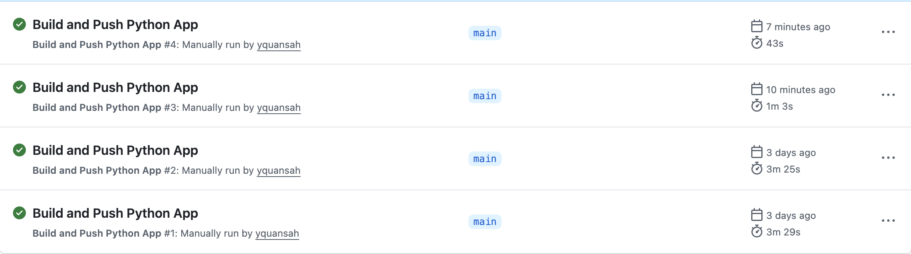
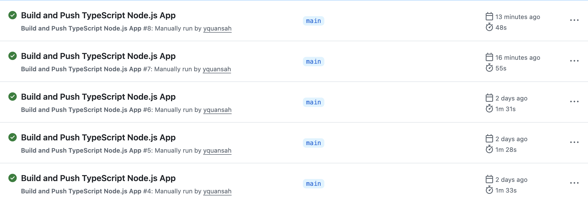

# Sample Projects

This repository is comprised of a bunch of basic programs written in different languages for demonstration purposes on building/pushing docker images to the [ghcr](https://docs.github.com/en/packages/working-with-a-github-packages-registry/working-with-the-container-registry).

The repository uses [blacksmith](https://blacksmith.sh) for GitHub Actions workflows and has shown significant improvments in Action workflow performance leveraging Docker caching, and powerful machines that blacksmith gives you out of the box.

You can see up to a 4.8x improvement on Python builds:

And up to 1.8x improvment on Node.js builds:

Blacksmith also has a variety of documentation on how to save money on GH Actions in [general](https://www.blacksmith.sh/blog/how-to-reduce-spend-in-github-actions).
